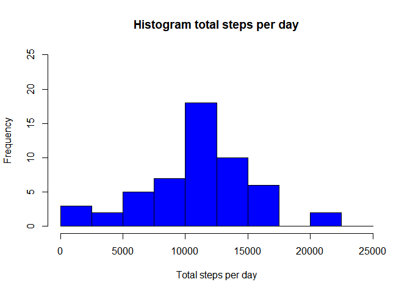
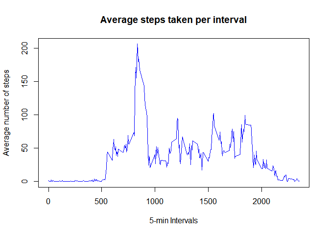
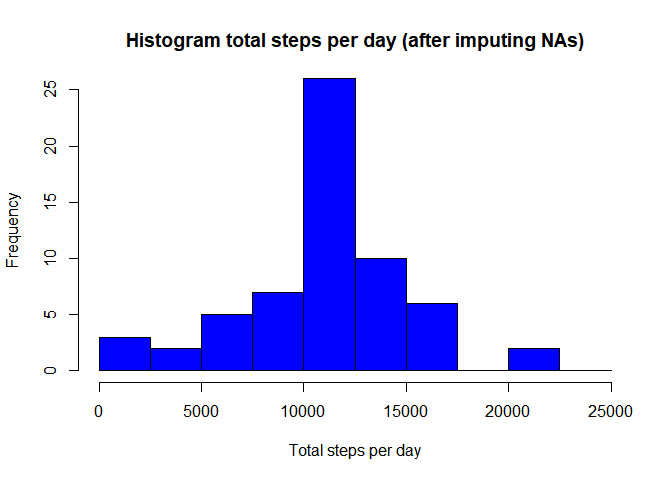
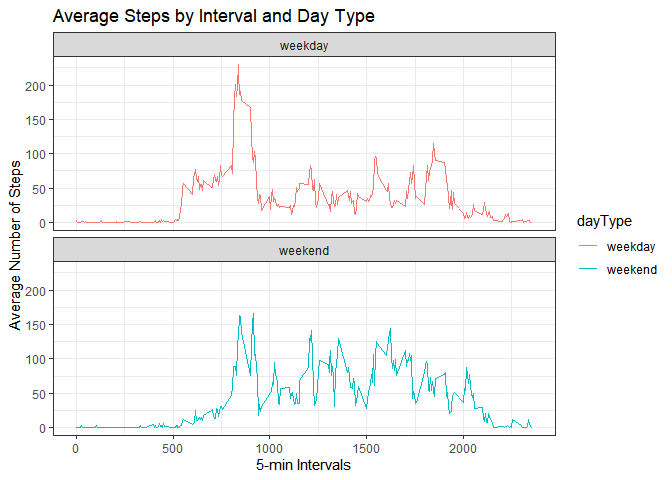

## Introduction

This assignment makes use of data from a personal activity monitoring device. This device collects data at 5 minute intervals through out the day. The data consists of two months of data from an anonymous individual collected during the months of October and November, 2012 and include the number of steps taken in 5 minute intervals each day.

The variables included in this dataset are:

steps: Number of steps taking in a 5-minute interval (missing values are coded as NA)

date: The date on which the measurement was taken in YYYY-MM-DD format

interval: Identifier for the 5-minute interval in which measurement was taken

The dataset is stored in a comma-separated-value (CSV) file and there are a total of 17,568 observations in this dataset.


## Loading and preprocessing the data

Reading and exploring the data

```r
data <- read.csv("activity.csv")
dim(data)
```

```
## [1] 17568     3
```

```r
names(data)
```

```
## [1] "steps"    "date"     "interval"
```

```r
summary(data)
```

```
##      steps            date              interval     
##  Min.   :  0.00   Length:17568       Min.   :   0.0  
##  1st Qu.:  0.00   Class :character   1st Qu.: 588.8  
##  Median :  0.00   Mode  :character   Median :1177.5  
##  Mean   : 37.38                      Mean   :1177.5  
##  3rd Qu.: 12.00                      3rd Qu.:1766.2  
##  Max.   :806.00                      Max.   :2355.0  
##  NA's   :2304
```
The names of the variables are representative enough.  
We can see there are some observations with NA vaues.  
The date column is of character. Let's convert it to type Date.


```r
data$date <- as.Date(data$date)
```


## What is mean total number of steps taken per day?

For this part of the assignment, the missing values are ignored.

Let's apply 'sum' function to steps variable, but clustering by date.
Creating a hist to represent the frequency of the stepsPerDay calculated.

**using the same y-lim than hist with NAs processed (in chapters below), for visual comparison**


```r
sumStepsPerDay <- aggregate(steps ~ date, data, sum, na.rm = TRUE)
hist(sumStepsPerDay$steps, breaks = seq(0, 25000, by = 2500),
     main="Histogram total steps per day",
     xlab = "Total steps per day", col = "blue", ylim = c(0,25))
```

<!-- -->

Calculating the **mean** of the total number of steps taken per day:


```r
mean(sumStepsPerDay$steps)
```

```
## [1] 10766.19
```

Calculating the **median** and median of the total number of steps taken per day:


```r
median(sumStepsPerDay$steps)
```

```
## [1] 10765
```

## What is the average daily activity pattern?

Making a time series plot of the 5-minute interval (x-axis) and the average number of steps taken, averaged across all days (y-axis).
For that, let's use aggregate again but clustering by the 5-min interval variable.


```r
meanStepsPerInterval <- aggregate(steps ~ interval, data, mean, na.rm = TRUE)

plot(x=meanStepsPerInterval$interval, y=meanStepsPerInterval$steps, type="l",
     main="Average steps taken per interval",
     ylab="Average number of steps", xlab="5-min Intervals",
     col="blue", lwd=1.5)
```

<!-- -->


Which 5-minute interval, on average across all the days in the dataset, contains the maximum number of steps?

Visually, it can be detected, but let's look for it via code


```r
max5MinInterval <- meanStepsPerInterval[which.max(meanStepsPerInterval$steps),]$interval
```

The 5-minute interval with the highest mean(i.e. hghest total number as well) is **835**


## Imputing missing values

To remove/diminish the bias introduced by NAs, devising a srtategy to fill those with  
the mean/median for that day, or the mean for that 5-minute interval, etc.

### Calculating the total number of missing values in the dataset:

The total number of NA values can be observed in the summary initially displayed.
But, it can be directly obtained via sum(is.na(X)) command as well:


```r
NaValues <- is.na(data$steps)
sumNaValues <- sum(is.na(data$steps))
```

The total number of NA values is **2304**

### Creating a copy of the original dataset with the NAs filled in.


```r
newData <- data
```

Using the mean for the interval calculated previously.  
Create a match vector of length 2304 (number of NAs) to associate every NA to the corresponding mean value to assign.


```r
matchNAsIntervals <- match((newData [NaValues == TRUE,]$interval), meanStepsPerInterval$interval)
newData [NaValues == TRUE,]$steps <- meanStepsPerInterval[matchNAsIntervals, ]$steps
```

### With new dataset, recalculate hist, mean and median (as previously) of total number of steps taken per day again 

Creating a hist to represent the frequency of the stepsPerDay calculated.


```r
sumStepsPerDay <- aggregate(steps ~ date, newData, sum)
hist(sumStepsPerDay$steps, breaks = seq(0, 25000, by = 2500),
     main="Histogram total steps per day (after imputing NAs)",
     xlab = "Total steps per day", col = "blue", ylim = c(0,25))
```

<!-- -->


Calculating the **mean** of the total number of steps taken per day:


```r
mean(sumStepsPerDay$steps)
```

```
## [1] 10766.19
```

Calculating the **median** and median of the total number of steps taken per day:


```r
median(sumStepsPerDay$steps)
```

```
## [1] 10766.19
```


### Do these values differ from the estimates from the first part of the assignment?  

Only the median differs (only slightly: 10766.19 new vs 10765 original) in comparison to the first part of the assignment.
The values are very similar (even identical for the mean) in comparison with the ones from the first part.
This is because average functions have been used for replacing the NAs.


### What is the impact of imputing missing data on the estimates of the total daily number of steps?

The frequency of values at the center of the histogram has clearly increased since we have inserted average values to impute NAs. The frequency of the other sections has not been modified.


## Are there differences in activity patterns between weekdays and weekends?

Considering the previously created dataset (with NAs converted).

Let's ceate a new variable weekday (Mon .. Sun) in the dataset.


```r
Sys.setlocale("LC_TIME", "English")
```


```r
newData$weekday <- weekdays(newData$date)
```

Let's create a var that distinguises weekdays and with that input,  
another one that distinguises weekdays from weekends


```r
newData$weekday <- weekdays(newData$date)
newData$dayType <- ifelse(newData$weekday %in% c("Saturday", "Sunday"), 
                          yes = "weekend",
                          no = "weekday")
newData$dayType <- as.factor(newData$dayType)
```

Making a plot of the 5-minute interval (x-axis) and the average number of steps taken, averaged across all weekday days or weekend days (y-axis).
For that, let's use aggregate, clustering by the 5-min interval variable and dayType factor.


```r
meanStepsPerIntervalAndDayType <- aggregate(steps ~ interval+dayType, 
                                             newData, mean)

library(ggplot2)
```

```
## Warning: package 'ggplot2' was built under R version 4.1.3
```

Plotting using ggplot2


```r
plotMeanStepsIntervalDayType <- ggplot(meanStepsPerIntervalAndDayType, aes(x = interval , y = steps, color = dayType)) + 
  geom_line() + ggtitle("Average Steps by Interval and Day Type") + 
  xlab("5-min Intervals") + 
  ylab("Average Number of Steps") +
  facet_wrap(~dayType, ncol = 1, nrow=2) +
  theme_bw()

print(plotMeanStepsIntervalDayType)
```

<!-- -->
